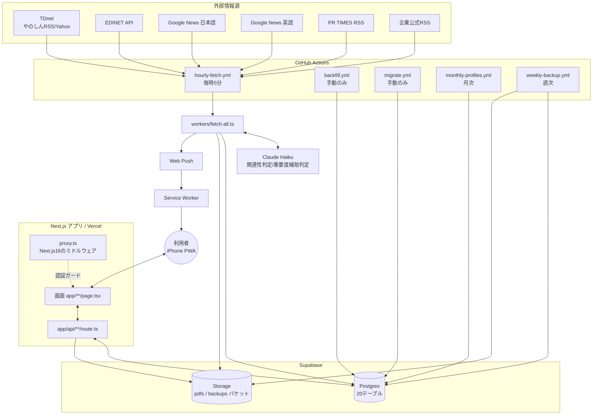

# 開示レーダー(kaiji-radar) 現状報告書

調査日時: 2026-08-08 / 調査者: Claude(監査担当として)

---

## 1. 調査対象と確認範囲

| 項目 | 内容 |
|---|---|
| リポジトリ | `roromukuro-afk/kaiji-radar`(private)、ローカルパス `C:\Users\rorom\kaiji-radar` |
| デフォルトブランチ | `main` |
| 最新コミットSHA | `b2fba09f8e644cd8338932cfc8ff0c396acdfc29` |
| 最新コミット日時 | 2026-08-08 16:57:15 +0900 |
| origin/main との差分 | なし(完全に同期。未追跡ファイル `scripts/_*.ts` 5個のみ残存、git管理外) |
| 本番Vercelデプロイ | `dpl_Cz4tFW4AL52do6hjbkn18n4XfmTM`、`state: READY`、コミット `b2fba09` と一致(**本番確認済み**) |
| 接続できたサービス | GitHub(`gh` CLI)、Supabase(MCP経由、Project Ref `akffpkzhparxbggsddmi`)、Vercel(MCP経由) |
| 接続できなかったサービス | なし(全て接続可能だったため、本報告書内の「確認不能」は主に「未実装/未接続の機能自体が存在しない」ケース) |
| 本番確認の範囲 | Supabase本番DBへ直接SQLクエリを実行して実データを確認。Vercel本番デプロイ状態を確認。GitHub Actions実行ログを確認。**ただし実際のブラウザ操作(ログイン、画面遷移、プッシュ通知受信等)による目視確認は今回未実施** |

**調査手法の補足**: 本報告書は私自身の直接調査に加え、6つの並列調査(GitHub Actions/画面/API/DBマイグレーション/ノイズ・関連性ルール/バックアップ・PDF・通知)の結果を統合しています。各所見は可能な限りファイルパス・行番号・関数名を明記し、断定と推測を区別しています。

---

## 2. 開示レーダーの現在の目的と利用方法

コードとSTATUS.md/README.mdから確認できる範囲での説明です。

開示レーダーは、利用者(単一ユーザー、Googleアカウント `roromukuro@gmail.com` に限定)が登録した日本株29銘柄について、以下の情報源を毎時自動巡回し、関連する記事を保存・プッシュ通知する個人用Webアプリです。

- TDnet(適時開示、やのしんRSS経由、Yahoo Financeフォールバック)
- EDINET(有価証券報告書等、公式API)
- 企業公式RSS(`stock_profiles.rss_urls`)
- PR TIMES(プレスリリース検索RSS)
- 国内ニュース(Google News日本語検索)
- 海外ニュース(Google News英語検索)

記事はAI(Claude Haiku)による関連性判定・機械的なノイズ除外ルールを経て保存され、除外候補でなければプッシュ通知されます。記事本文の自動要約や投資判断(売買推奨)を行う機能は見当たらず、`lib/processors/relevance.ts` 冒頭コメントにも「関連性判定にのみ使用し、投資判断・重要度評価は行わない」と明記されています(後述の「重要度分類機能」も、開示カテゴリの客観分類であり売買判断ではない設計)。

---

## 3. システム全体構成

---

## 4. 現在実装されている機能一覧

| 分類 | 機能 | 状態 | 本番確認 | 主なコード | 使用テーブル | 補足 |
|---|---|---|---|---|---|---|
| 情報取得 | TDnet取得(Tier1やのしん/Tier2 Yahoo) | 本番確認済み | ✅ | `lib/fetchers/tdnet.ts`, `workers/fetch-all.ts:296-361` | articles | 土日は候補0件が正常(市場休場) |
| 情報取得 | EDINET取得 | 本番確認済み | ✅ | `lib/fetchers/edinet.ts` | articles | 本セッションでAPIキー設定し復旧済み |
| 情報取得 | Google Newsニュース取得(日本語/英語) | 本番確認済み | ✅ | `lib/fetchers/news.ts` | articles | サーキットブレーカー実装済み(本セッション) |
| 情報取得 | Google News実URL解決 | 本番確認済み | ✅ | `lib/fetchers/google-news-decoder.ts` | articles.discovered_url/canonical_url | Google非公開APIに依存、失敗時は元リンクにフォールバック |
| 情報取得 | PR TIMES取得 | 実装済み・未検証 | — | `lib/fetchers/news.ts:fetchPRTimes` | articles | 直近の実行では新規0件、正常動作の直接確認は次回に持ち越し |
| 情報取得 | 企業公式RSS取得 | 一部実装 | — | `lib/fetchers/news.ts:fetchGenericRss` | articles | `stock_profiles.rss_urls`が空の銘柄では動作せず、現状全銘柄で`official`保存0件が継続 |
| 関連性判定 | AIキーワード事前判定+Claude Haiku判定 | 本番確認済み | ✅ | `lib/processors/relevance.ts` | articles.relevance | |
| 関連性判定 | 銘柄名=球団名銘柄のAI強制判定 | 本番確認済み | ✅ | `stock_profiles.force_ai_relevance_check`, `workers/fetch-all.ts` | stock_profiles, articles | 本セッションで追加(9434/9984/8591) |
| ノイズ除外 | noise_rules(包括ルール) | 本番確認済み | ✅ | `workers/fetch-all.ts:applyExclusionRules`, `app/api/noise-rules/route.ts` | noise_rules | 実際に判定へ使用されている唯一のルールテーブル |
| ノイズ除外 | stock_keyword_rules(レガシー) | **不整合あり** | — | `app/api/feedback/route.ts`, `workers/fetch-all.ts:153-156` | stock_keyword_rules | UNIQUE制約と`onConflict`指定の不一致で書き込みが失敗している疑い(詳細9節) |
| ノイズ除外 | relevance_rules / excluded_patterns | **未使用** | — | (マイグレーションのみ) | relevance_rules, excluded_patterns | コードから一切参照なし。noise_rulesに実質置き換えられたと推測 |
| ノイズ除外 | 保護キーワード(安全ソース) | 本番確認済み | ✅ | `lib/noise/protection.ts` | — | TDnet/EDINET/officialは絶対除外しない |
| ノイズ除外 | 再分類(reclassify) | 一部不整合 | — | `scripts/reclassify-articles.ts`, `app/api/reclassify/route.ts` | noise_rules, articles | 2実装がほぼ重複、`apply_count`更新方法とページング有無が食い違う |
| フィードバック | 記事詳細フィードバック(関連あり/なし等) | 本番確認済み | ✅ | `app/article/[id]/FeedbackPanel.tsx`, `app/api/feedback/route.ts` | relevance_feedback, articles | `relevance_feedback`はworkerから一切参照されず、記録されるだけ |
| フィードバック | ノイズ報告→ルール登録 | 本番確認済み | ✅ | `app/article/[id]/NoiseReportPanel.tsx` | noise_rules, relevance_feedback | |
| フィードバック | ルール管理画面での削除/切替 | **未実装(スタブ)** | — | `app/(dashboard)/feedback/page.tsx:240-263` | — | コード内コメントで「専用APIがまだない」と明記、実際には何も永続化されない |
| 開示種別分類 | event_type自動分類 | 本番確認済み | ✅ | `lib/classifiers/event-type.ts` | articles.event_type | 本セッション実装、要約ではなく機械的分類 |
| 重要度分類 | importance 3段階分類 | 実装済み・未検証 | — | `lib/classifiers/importance.ts` | articles.importance他 | 本セッション実装、直近実行では通常ニュースのみでcritical/important実例は未確認 |
| 訂正履歴 | article_updates表示 | 本番確認済み(バグ修正込み) | ✅ | `app/article/[id]/UpdateHistoryPanel.tsx` | article_updates, pdf_documents | 本セッションで「URL一致のみで毎回記録」バグを修正 |
| 通知 | Web Push送信 | 本番確認済み | ✅ | `lib/notifications/web-push.ts` | push_subscriptions, notification_history | 本セッション中に1484件送信成功を確認 |
| 通知 | 通知クリック時の遷移 | **不整合あり(バグ)** | — | `public/sw.js`, `lib/notifications/web-push.ts:buildPushPayload` | — | ペイロード構造不一致で常に`/`へ遷移(9節参照) |
| 通知 | 銘柄別・種別別通知設定 | 実装済み・未検証 | — | `app/stocks/[code]/NotifyEventTypesSettings.tsx` | stock_profiles.notify_event_types | |
| 銘柄管理 | 追加/一時停止/削除 | 本番確認済み | ✅ | `app/(dashboard)/manage/page.tsx`, `app/api/stocks/route.ts` | stocks, stock_profiles | |
| 状態監視 | ヘルスチェック・容量表示 | 一部不整合 | — | `app/(dashboard)/status/page.tsx`, `app/api/health/route.ts` | health_checks等7テーブル | 全体判定が`consecutive_failures`のみに依存(10節) |
| バックアップ | 週次自動バックアップ | 本番確認済み | ✅ | `workers/backup.ts` | 9テーブル(全15+中、6テーブル対象外) | 暗号化なし、復元不可(11節) |
| 共有 | ChatGPTへ共有ボタン | 実装済み・未検証 | — | `app/article/[id]/ShareToChatGptButton.tsx` | — | Web Share API、自動要約なし |

---

## 5. 画面一覧

| URL | 画面名 | 主な機能 | 状態 | 問題・未確認事項 |
|---|---|---|---|---|
| `/login` | ログイン | Google Identity Servicesでサインイン→`/api/auth/verify`でメール検証 | 本番確認済み | — |
| `/`(dashboard内) | 新着一覧 | 記事一覧・フィルター(銘柄/ソース/種別/重要度/既読等)・全既読化・手動更新 | 本番確認済み | ページ単体に認証チェックなし(10節) |
| `/article/[id]` | 記事詳細 | 本文・PDF・フィードバック・訂正履歴・重要度上書き・ChatGPT共有 | 本番確認済み | **GETリクエストで無条件に既読化する副作用あり**(`page.tsx:35`) |
| `/stocks` | 銘柄一覧 | 銘柄カード(未読/24h/重要未読件数) | 本番確認済み | サーバーコンポーネントで`redirect("/login")`あり(有効) |
| `/stocks/[code]` | 銘柄詳細 | ソース別タブ・統計・監視プロフィール・通知種別設定 | 本番確認済み | `DashboardLayout`が適用されずヘッダー/下部ナビが無い(UI不一致) |
| `/manage` | 銘柄管理 | 追加・一時停止・削除(確認ダイアログあり) | 本番確認済み | ページ単体に認証チェックなし |
| `/rules` | ノイズルール管理 | ルール一覧・追加・有効/無効・削除・再分類・除外復元 | 本番確認済み | ページ単体に認証チェックなし |
| `/feedback` | フィードバック | フィードバックログ・キーワードルール一覧・除外候補記事 | **一部スタブ** | ルール削除/切替ボタンが実際には機能しない(4節参照) |
| `/status` | 状態画面 | ヘルスチェック・取得ジョブ履歴・バックアップ履歴・容量・操作ログ | 本番確認済み | 全体判定ロジックの穴あり(10節) |
| `/history` | 履歴 | 操作ログ一覧(ページネーション) | 本番確認済み | Supabaseへ直接クエリ(API経由なし)、ページ単体に認証チェックなし |

**iPhone/PWA関連の確認事項**:
- `app/layout.tsx`でSafariノッチ対応(`viewport-fit=cover`)、Service Worker登録、`apple-touch-icon`設定は確認済み(コード上)。
- `app/(dashboard)/layout.tsx`は`min-h-[44px]`のタップ領域、`safe-top`/`safe-bottom`(`env(safe-area-inset-*)`)を下部ナビ・ヘッダーに適用。
- 実機(iPhone)でのPWA表示・通知許可フロー・オフライン動作は**本番未確認**(STATUS.mdにも「iPhoneでのUI/Push通知目視確認待ち」と記載あり、コードのみでは検証不能)。

---

## 6. API一覧

全11件のroute.tsを確認しました。

| API | メソッド | 目的 | 認証 | 使用テーブル | 呼び出し元 | 状態 |
|---|---|---|---|---|---|---|
| `/api/articles` | GET/PATCH | 記事一覧取得・既読/重要度更新・一括既読 | あり | articles, article_stocks | `/`, `/article/[id]` | 本番確認済み |
| `/api/stocks` | GET/POST/PATCH | 銘柄CRUD・通知種別設定 | あり | stocks, stock_profiles, operation_logs | `/manage`, `/`, `/stocks/[code]` | 本番確認済み |
| `/api/stocks-nav` | GET | 銘柄別未読/新着件数 | あり | stocks, article_stocks | **呼び出し元不明(未使用の可能性)** | 一部実装 |
| `/api/feedback` | GET/POST | フィードバック記録・ログ・ルール一覧取得 | あり | relevance_feedback, articles, stock_keyword_rules, operation_logs | `/feedback`, `FeedbackPanel`, `NoiseReportPanel` | **不整合あり**(9節) |
| `/api/noise-rules` | GET/POST/PATCH/DELETE | ノイズルールCRUD | あり | noise_rules, stocks | `/rules`, `NoiseReportPanel` | 本番確認済み |
| `/api/reclassify` | POST | 既存記事の再分類・除外復元 | あり(実処理はservice role) | noise_rules, stocks, articles, operation_logs | `/rules`, `NoiseReportPanel` | 一部不整合(9節) |
| `/api/health` | GET | 状態画面用データ集約 | あり | health_checks等7テーブル | `/status` | **エラー処理なし**(クエリ失敗時も200で空データを返す可能性) |
| `/api/push` | POST/DELETE | Push購読登録/解除 | あり | push_subscriptions | `PushNotificationButton` | エラー処理なし、`user_id`紐付けなし(単一ユーザーのため実害は限定的) |
| `/api/manual-fetch` | POST | GitHub Actions手動トリガー | あり | fetch_jobs, operation_logs | `/`(「今すぐ更新」ボタン) | 実行中ジョブがあれば429でデバウンス、本番確認済み |
| `/api/auth/callback` | GET | OAuthコード交換 | 不要(認証確立自体) | なし | **呼び出し元不明(未使用の可能性)** | 実装済み・未使用 |
| `/api/auth/verify` | POST | Google ID Token検証後の許可メール確認 | あり | なし | `/login` | 本番確認済み(実際に機能する認証境界) |

---

## 7. DB・Storage構成

全20テーブル(マイグレーション9本を積み上げた最終形)。詳細なカラム/制約/インデックスは別紙(調査エージェント出力)に基づき、主要点のみ記載します。

### コアテーブル
- **stocks**: 銘柄マスタ。`code`にUNIQUE。
- **stock_profiles**: 銘柄プロフィール。`notify_event_types`(通知種別設定)、`force_ai_relevance_check`(本セッション追加)を含む。
- **stock_profile_history**: プロフィール変更履歴。**コード上の参照0件(未使用)**。
- **articles**: 記事本体。56箇所から参照される中心テーブル。`source_type`/`relevance`/`user_relevance`/`event_type`/`importance`/`importance_source`にCHECK制約あり。GINトライグラムインデックス4本(全文検索用)。
  - **重要な不整合**: `is_important BOOLEAN`カラムが`lib/supabase/schema.sql`とアプリコードの随所で使われているが、`supabase/migrations/`配下のどのファイルにも追加DDLが存在しない。**マイグレーション未記録のまま本番DBに直接カラムが追加された可能性が高い**(推測)。
- **article_stocks**: 記事⇔銘柄の中間テーブル(複合PK)。
- **article_updates**: 訂正履歴。
- **pdf_documents**: PDF抽出結果。`articles.pdf_document_id`との明示的FK制約はなし(アプリ側で紐付け)。

### 通知・監視系
- **push_subscriptions** / **notification_history** / **health_checks** / **fetch_jobs** / **operation_logs** / **backup_logs** / **exclusion_logs** / **system_settings**

### 学習・ノイズ系(5テーブル、実態にばらつきあり)
- **noise_rules**: 実質的に唯一機能しているルールテーブル(24箇所から参照)。
- **stock_keyword_rules**: 使用されているが書き込みが失敗している疑い(9節)。
- **relevance_feedback**: 書き込みはされるが読み取り側(worker)が存在せず、記録するだけで判定に反映されない。
- **relevance_rules** / **excluded_patterns**: **コード上の参照0件、完全に未使用**。

### Storage バケット
- `pdfs`(PDF原本、`lib/processors/pdf.ts`)
- `backups`(週次バックアップJSON、`workers/backup.ts`)
- いずれもバケット作成SQL/マイグレーションはリポジトリ内に見当たらず、Supabaseダッシュボード側で手動作成されたと推測されます。

### RLS(Row Level Security)
全20テーブルで`ENABLE ROW LEVEL SECURITY` + `CREATE POLICY "authenticated_all" ... USING (true) WITH CHECK (true)`という同一パターンが適用されています。**これは「認証済みSupabaseユーザーなら誰でも全テーブルを読み書きできる」ポリシーであり、`ALLOWED_EMAIL`によるアクセス制限はDBレイヤーではなくアプリケーションレイヤー(`/api/auth/verify`, `/api/auth/callback`, 各サーバーコンポーネントの`redirect`)でのみ行われています**(10節で詳述)。

### schema.sqlとマイグレーションの乖離(要注意)
`lib/supabase/schema.sql`は「参照用ドキュメント」の位置づけと見られますが、以下が反映されていません。
- 学習・ノイズ系5テーブル全て(`relevance_feedback`等)が未記載
- `health_checks.status`のCHECK制約が旧版(`checking`/`key_missing`が未反映)
- 逆に`is_important`カラムは`schema.sql`側にのみ存在し、マイグレーション側に対応するDDLがない

---

## 8. 情報取得フロー

各情報源について、取得から保存・通知までの流れです(すべて`workers/fetch-all.ts`が起点、GitHub Actions `hourly-fetch.yml`により毎時5分に実行)。

### TDnet
- **取得方法**: Tier1=やのしんWEB-API `{code}.rss`(銘柄別、1回リトライ)。失敗時Tier2=Yahoo Finance Japanのスクレイピング(`fetchTdnetByCodeDirect`、HTMLパース)。
- **期間**: 通常時は前回実行から遡って3時間(`LOOKBACK_HOURS_NORMAL=3`)。前回実行から6時間以上空いていた場合は「復旧モード」となり、経過時間+1時間(上限48時間)まで遡及。
- **重複防止**: `tdnet_doc_id`のUNIQUE部分インデックス。
- **健全性判定**: 失敗銘柄が全体の半数超なら`failed`、一部失敗なら`degraded`、全成功なら`ok`(`health_checks`更新)。
- **弱点**: Tier2(Yahoo Financeスクレイピング)はHTML構造依存の正規表現パースであり、サイト側の変更で静かに壊れるリスクがある。

### EDINET
- **取得方法**: 公式API(`api.edinet-fsa.go.jp`)、書類種別コードで対象書類を判定。
- **APIキー**: 本セッション中にユーザーが取得し設定、`health_checks`で`ok`を確認済み。
- **弱点**: APIキーが未設定だと`key_missing`扱いでスキップされる(以前の状態)。取得はできているが、大量保有報告書等の第三者提出書類の網羅性は今回未検証。

### Google News(日本語/英語)
- **取得方法**: `https://news.google.com/rss/search?q=...`をキーワード(銘柄名・コード・別名等、最大5個/4個)ごとに検索。
- **実URL解決**: Googleの非公開内部エンドポイント(`_/DotsSplashUi/data/batchexecute`)を使い、リダイレクトリンクを実記事URLへ解決(本セッションで実装)。**Google側の実装変更で壊れる可能性がある非公式手法**であり、実際に本セッション中に一時的なHTTP 503ブロックが発生したことを確認済み。
- **サーキットブレーカー**: 連続失敗5回で以降のGoogle News取得(検索・URL解決とも)をその回の実行中スキップする仕組みを本セッションで追加。
- **重複防止**: `discovered_url`(生リンク)/`canonical_url`(正規化URL)により、Googleが同一記事に別トークンを発行するケースにも対応。
- **弱点**: 依然としてGoogle側の非公式挙動に依存。

### PR TIMES
- **取得方法**: `prtimes.jp/rss_search.php`を銘柄名で検索。
- **重要な修正(本セッション)**: 以前は`source_type: "official"`(安全ソース扱い)だったが、`pr_times`という独立したsource_typeに分離。安全ソース扱いを外したことで通常の関連性判定・除外ルールが適用されるようになった。

### 企業公式RSS
- **取得方法**: `stock_profiles.rss_urls`に登録されたフィードを`fetchGenericRss`で取得。
- **現状**: `official`ソースの保存件数は継続して0件(全実行を通じて確認)。`rss_urls`が未設定の銘柄が多い、または設定されていても機能していない可能性がある(**本番未確認**、`stock_profiles.rss_urls`の実データ内容は今回未調査)。

### PDF取得・保存・本文抽出
- **手法**: `pdf-parse`のみ(OCR/Tesseract.jsはコード上完全削除済みだが、`package.json`に依存関係は残存=未使用の重い依存)。
- **失敗時**: 例外をthrowせず`extractionMethod: "failed"`を含む結果を返し処理継続。
- **保存先**: Storageバケット`pdfs`、パス`{sourceType}/{docId}.pdf`。

---

## 9. 関連性・ノイズ判定の実態

### 実際に機能しているもの
1. **AI関連性判定**(`checkRelevance`, Claude Haiku) — quickKeywordMatch失敗時、または`force_ai_relevance_check=true`の銘柄で必ず実行。
2. **noise_rules** — worker起動時にロードされ`applyExclusionRules`内で実際に判定に使用。UIからの追加・編集・削除・再分類も一通り機能する経路が存在。
3. **保護キーワード**(`GLOBAL_PROTECT_KEYWORDS` + noise_rulesの`strengthen`ルール) — 安全ソース以外でも決算・M&A等のキーワードがあれば除外を回避。
4. **除外の復元**(`--restore`/「除外を復元」ボタン) — 機能する経路として存在するが、`exclusion_reason`に特定文字列を含むノイズルール由来の除外のみが対象で、ユーザー手動フィードバックやAI判定irrelevantは対象外。

### 不整合・機能していない疑いがあるもの
1. **`stock_keyword_rules`への書き込み(要修正級)**: `app/api/feedback/route.ts`が`upsert(..., { onConflict: "stock_id,keyword" })`を実行していますが、実DBのUNIQUE制約は`(stock_id, keyword, language, action)`の複合キーです。単独カラム指定の`onConflict`は実DBの制約と一致せず、PostgRESTがエラーを返す可能性が高いです。このエラーは`try/catch`で握り潰される設計(`app/api/feedback/route.ts`内、コメント「Table may not exist yet」)のため、ユーザーが「このキーワードを除外候補に追加」を選んでも**実際にはルールが登録されていない疑いがあります**(確実性: 可能性高、本番確認推奨)。
2. **`relevance_feedback`が判定に反映されない**: `workers/fetch-all.ts`のどこにも`relevance_feedback`テーブルへのSELECTが存在しません。ユーザーのフィードバックは`articles.user_relevance`/`exclusion_candidate`の直接更新分のみ通知判定(`notifyArticle`)に反映され、`relevance_feedback`テーブル自体は記録専用ログになっています。
3. **`relevance_rules`/`excluded_patterns`は死んだテーブル**: マイグレーションでテーブル定義・RLSポリシーが作られているだけで、コードからの参照は皆無です。
4. **`/feedback`画面のルール削除/有効切替ボタンはスタブ**: `app/(dashboard)/feedback/page.tsx:240-263`のコメントに「専用APIがまだない」と明記されており、削除ボタンは`POST /api/feedback`へ本来の用途と異なるペイロード(記事IDでもないルールIDを`article_id`として送信)でログを送るだけ、切替ボタンはローカルstateを変えるだけでAPIすら呼びません。画面上は反映されたように見えますが、リロードすると元に戻ります。
5. **`scripts/reclassify-articles.ts`と`app/api/reclassify/route.ts`の実装差異**: ほぼ同一ロジックの並行実装ですが、(a) APIルート版は1000件超の銘柄で記事を取りこぼす可能性(ページング未実装)、(b) `noise_rules.apply_count`の更新方法が「累積加算」(スクリプト)と「今回分で上書き」(API)で異なる、という2点の挙動差異があります。

---

## 10. 認証・セキュリティの現状

| レイヤー | 実装 | 実効性 |
|---|---|---|
| Google OAuth | `app/login/page.tsx`でGoogle Identity Services使用 | 有効(Googleの実アカウントが必要) |
| 許可メールアドレス制限 | `app/api/auth/verify/route.ts`で`process.env.ALLOWED_EMAIL`と照合、不一致なら`signOut()` | 有効(実際に機能する認証境界) |
| `proxy.ts`(旧middleware.ts相当) | 全ルートに対しGoogle OAuth+許可メール確認→未認証は`/login`へリダイレクト | **Next.js 16の正式な規約に沿った実装(下記補足参照)。ロジック自体は正しいが、本番での実動作は未確認** |
| サーバーコンポーネント個別チェック | `/stocks`, `/stocks/[code]`, `/article/[id]` は`redirect("/login")`を明示的に実装 | 有効 |
| クライアントコンポーネントページ | `/`, `/history`, `/manage`, `/rules`, `/feedback` はページ自体に認証チェックなし、API呼び出しの401またはSupabase RLSに依存 | `proxy.ts`が機能していれば問題なし。機能していない場合、ページの初期表示(枠組み)は未認証でも見える可能性がある |
| API Route | 全11件中9件(auth関連2件を除く)が`supabase.auth.getUser()`で401チェック | 有効 |
| Supabase RLS | 全20テーブルで`authenticated_all`ポリシー(`USING (true)`) = **認証済みなら誰でも読み書き可能**。メールアドレスによる絞り込みはRLSレベルでは行われていない | メール制限はアプリ層のみ。Supabase Authで別のGoogleアカウントがサインインできてしまった場合(Google側の設定次第)、DBレイヤーでは防げない |
| Service Role Key の使用箇所 | `lib/supabase/server.ts:createServiceClient()`(`app/api/reclassify/route.ts`から使用)、`workers/*.ts`全般 | RLSを完全にバイパスする強い権限。使用箇所は限定的だが、`reclassify`は入力バリデーションが薄い(9節) |

**`proxy.ts`について(重要な補足・訂正)**: 調査の過程で、`node_modules/next/package.json`のバージョンが`16.2.9`という一見不審な値であることや、`AGENTS.md`に「これはあなたの知っているNext.jsではない」という記述があることから、当初「プロンプトインジェクションの疑い」という指摘がありました。**しかし、npm公式レジストリ(`registry.npmjs.org`)に直接問い合わせたところ、Next.jsのlatestタグは実際に`16.3.0`であり、Next.js 16系は実在するバージョンです。** また同梱ドキュメント(`node_modules/next/dist/docs/01-app/01-getting-started/16-proxy.md`)の内容は「Next.js 16からMiddlewareはProxyに改称された(機能は同じ)」という一貫した説明で、`proxy.ts`の実装(named export `proxy` + `config.matcher`)とも整合しています。**これは悪意ある注入ではなく、私自身の知識(2026年1月時点の学習データ)に無い、実際のフレームワークの仕様変更である可能性が高いと判断します。** ただし、これが「本当にNext.js 16で`middleware.ts`から`proxy.ts`への改称が完全に自動的なドロップイン代替として機能するか」というランタイム上の実動作は、今回ドキュメント確認とnpmレジストリ照会に留まり、**本番での未認証アクセス試験(ログアウト状態で`/`に直接アクセスして`/login`へリダイレクトされるか)は未実施**です。ここは本番確認を推奨します。

---

## 11. 運用・監視・バックアップの現状

### 状態画面の「正常」判定
- 全体サマリー(`app/(dashboard)/status/page.tsx:126`): `health_checks`全レコードの`consecutive_failures < 3`が判定基準。**`status`カラム(`degraded`/`key_missing`等)は全体サマリーの判定に一切使われていません。** つまり一部ソースが`degraded`でも連続失敗回数が3未満なら「全システム正常」と表示される設計上の穴があります。
- ソース別表示は`status`と`consecutive_failures`を組み合わせた5段階(ok/warn/err/degraded/key_missing)で色分けされており、こちらは個別には妥当な実装です。
- `/api/health`自体にエラーハンドリングが一切なく(try/catchなし)、クエリが何らかの理由で失敗しても200 + 空データを返す可能性があります。「取得停止」と「取得ゼロ件(正常)」の区別はTDnetについては`tdnet_diag`で作り込まれていますが、他のソースは同等の作り込みは確認できませんでした。

### バックアップ
- **対象**: 9テーブル(stocks, stock_profiles, articles, article_stocks, pdf_documents, push_subscriptions, notification_history, operation_logs, system_settings)。
- **対象外(業務データ)**: `stock_profile_history`, `article_updates`, `fetch_jobs`, `exclusion_logs`。意図的な除外か単なる漏れかはコードから判断できません。
- **暗号化**: なし(平文JSON)。`push_subscriptions`(Web Push購読鍵)が平文で含まれる点は要注意です。
- **世代管理**: 最新8世代のみ保持(CI実行版のみ実装)。
- **復元(restore)**: **実際にDBへ書き戻す実装は存在しません。** `test-backup-restore.mjs`という名前のスクリプトはバックアップJSONの形式検証のみを行い、`console.log("実際のDB挿入は行いません")`と明記されています。**つまり「バックアップは取れているが、災害時に本当に復元できるかは未検証かつ復元コード自体が存在しない」状態です。**
- **CI版と手動版の食い違い**: `scripts/run-backup.mjs`(手動実行用)は`workers/backup.ts`(CI実行用)と対象テーブル・ページング実装が異なります。

### ログ・監査
`operation_logs`(管理操作)、`exclusion_logs`(除外記録)、`notification_history`(通知結果)はいずれも実際に書き込まれ、対応する画面(`/history`、`/status`)から閲覧可能です。

---

## 12. 確認できた不具合・不整合

| 重要度 | 現象 | 根拠 | 影響 | 確実性 |
|---|---|---|---|---|
| 高 | プッシュ通知をタップしても常にトップページ(`/`)へ遷移し、記事詳細に飛ばない | `public/sw.js`の`push`ハンドラがペイロード直下の`url`を参照するが、`lib/notifications/web-push.ts:buildPushPayload`は`data.url`にネストして生成しており構造が一致しない | 通知から記事へワンタップで飛べず、利用者は自分でアプリを開いて探す必要がある | 確定(コード比較で明白) |
| 高 | 「このキーワードを除外候補に追加」等のフィードバック操作でルールが実際には登録されていない疑い | `app/api/feedback/route.ts`の`upsert(onConflict:"stock_id,keyword")`が実DBのUNIQUE制約`(stock_id,keyword,language,action)`と一致しない。エラーはtry/catchで握り潰される | ユーザーが「登録した」と思っているノイズルールが実際には効いていない可能性 | 可能性高(要本番確認: 実際にupsertしてnoise発生を確認する必要あり) |
| 高 | 週次バックアップから実際にDBを復元する手段が存在しない | `scripts/test-backup-restore.mjs`はJSON整合性チェックのみでDB書き込みなし。他に復元スクリプトは見当たらない | 障害時、バックアップファイルはあっても復元コードを新規に書く必要がある(=実質的に災害復旧手順が未整備) | 確定(該当スクリプト全文確認済み) |
| 中 | 状態画面の全体サマリーが`degraded`状態を「正常」と表示しうる | `app/(dashboard)/status/page.tsx:126`の`overallOk`判定が`consecutive_failures`のみを見ており`status`を見ていない | 一部ソースの取得劣化に利用者が気づきにくい | 確定(コード上明白) |
| 中 | `/feedback`画面のルール削除・有効/無効切替が実際には機能しない | `app/(dashboard)/feedback/page.tsx:240-263`のコメントで開発者自身が「専用APIがまだない」「バックエンド更新はここに入る予定」と明記 | 利用者が操作しても実データは変わらず、リロードで元に戻る | 確定(コードコメントで自認) |
| 中 | `relevance_feedback`テーブルへの記録がworkerの判定に一切反映されない | `workers/fetch-all.ts`内に`relevance_feedback`への参照が0件 | フィードバックが「学習」として蓄積されている体裁だが、実際の自動判定改善には使われていない(明示的な`articles.user_relevance`更新分のみ有効) | 確定(grep結果に基づく) |
| 中 | `articles.is_important`カラムがマイグレーション履歴に存在しない | `supabase/migrations/`配下に対応するALTER TABLE文なし。`schema.sql`とコードには存在 | マイグレーション管理外の変更が本番DBに存在する可能性。今後`migrate.yml`実行時に想定外の挙動を招くリスク | 可能性高(要本番確認: 実DBの`\d articles`相当で確認) |
| 中 | バックアップ対象から`article_updates`等の業務データが漏れている | `workers/backup.ts`のTABLES配列に含まれない | 障害復旧時に訂正履歴等が失われる | 確定(コード上明白)、影響度は「意図的な設計」の可能性もあり要確認 |
| 低 | `notification_failed_count`がリセットされない | `lib/notifications/web-push.ts`にリセット処理なし | 一度失敗した記事は成功後もカウントが残り続け、閾値判定(2回以上→メール通知)の意味が薄れる長期的な誤差要因になりうる | 確定 |
| 低 | `push_subscriptions`がバックアップに平文で含まれる | `workers/backup.ts`のTABLES配列に含まれ、暗号化処理なし | Storageバケットへのアクセス権保持者はWeb Push鍵を読める(単一ユーザーアプリのため実害は限定的だが原則的な懸念) | 確定 |
| 低 | `/api/stocks-nav`, `/api/auth/callback`の呼び出し元が見つからない | フロントエンドコード全体をgrepしても参照なし | 未使用コードの残存(実害はほぼないが保守性を下げる) | 可能性高 |

---

## 13. 未使用・重複・形骸化している実装

**未使用テーブル**:
- `relevance_rules`, `excluded_patterns`, `stock_profile_history`(いずれもコード参照0件)

**未使用の可能性があるAPI**:
- `app/api/stocks-nav/route.ts`(フロントエンド呼び出し元なし)
- `app/api/auth/callback/route.ts`(ログインフローは`/api/auth/verify`方式に置き換わっており、こちらの`code`交換フローを呼ぶコードが見当たらない)

**未使用の依存関係**:
- `tesseract.js`(OCR実装はコード上完全削除済みだが`package.json`に残存)

**実態と名前が違う処理・形骸化**:
- `app/(dashboard)/feedback/page.tsx`の削除/切替ボタン(4節・12節参照、実際は何も変更しない)
- `scripts/test-backup-restore.mjs`(「restore」という名前だが実際にはDBへ書き込まない検証専用スクリプト)
- `articles.discovered_url`/`canonical_url`(本セッションで実装)は新規記事のみ対象、過去14,500件超の記事には適用されていない(意図的な設計として報告済みだが、念のため再掲)

**ドキュメントとコードの不一致**:
- `lib/supabase/schema.sql`が学習・ノイズ系5テーブルおよび`health_checks`の最新CHECK制約を反映していない
- `lib/processors/pdf.ts`冒頭コメントが「OCRフォールバックあり」と読める記述のまま、実装はOCR完全削除済み

**古い互換処理**:
- `stock_keyword_rules`テーブルの`active`/`is_active`カラム並存(マイグレーションコメントに「workerは`is_active`を使うが列名は`active`だった」という経緯の記載あり)

---

## 14. 本番確認が必要な項目

| 項目 | 確認方法 |
|---|---|
| `articles.is_important`が実DBに存在し、マイグレーション外で追加されたか | Supabaseダッシュボードの Table Editor で`articles`のカラム定義を確認、または`\d articles`相当のSQLを実行 |
| `stock_keyword_rules`へのupsertが実際に失敗しているか | `/article/[id]`でフィードバック送信し、直後に`select * from stock_keyword_rules order by created_at desc limit 5`で確認 |
| `proxy.ts`が本番で実際に認証ガードとして機能しているか | ログアウト状態(シークレットウィンドウ)で`https://kaiji-radar.vercel.app/`に直接アクセスし、`/login`へリダイレクトされるか確認 |
| プッシュ通知タップ時の遷移先 | 実機(iPhone)でプッシュ通知を受け取りタップ、`/`に遷移するか`/article/[id]`に遷移するか確認 |
| `official`(企業公式RSS)が常に0件保存な理由 | `stock_profiles.rss_urls`の実データ内容をSupabaseで確認(空配列が大半か、URLはあるが取得失敗しているか) |
| バックアップ`backups`/`pdfs`バケットのアクセス権設定 | Supabaseダッシュボードのstorage設定でpublic/privateを確認 |
| iPhoneでのPWA・通知の実機動作 | 実機でホーム画面追加→通知許可→通知受信を一通り確認(STATUS.mdにも既知の未確認事項として記載あり) |

---

## 15. 現状の完成度評価(5段階)

| 観点 | 評価 | 根拠 |
|---|---|---|
| 情報取得 | 4/5 | TDnet/EDINET/Google News/PR TIMESの複数ソース・フォールバック・サーキットブレーカーまで整備。ただしGoogle News URL解決が非公式APIに依存し既に一度ブロックを経験、企業公式RSSはほぼ機能していない |
| 重複防止 | 4/5 | doc_id部分UNIQUEインデックス、canonical_urlによる正規化重複判定。本セッションで「URL一致のみでの誤更新」バグを修正済み |
| 関連性判定 | 3/5 | AI判定・quickKeywordMatchの組み合わせは妥当だが、銘柄名=一般名詞/球団名の曖昧性は個別対応(9434/9984/8591のみ)に留まり、汎用的な仕組みではない |
| ノイズ除外 | 3/5 | noise_rulesは実際に機能しているが、stock_keyword_rulesの書き込み不整合、relevance_rules/excluded_patternsの完全死蔵、reclassifyの実装重複がある |
| 通知 | 3/5 | Web Push送信自体は実績あり(1484件成功実測)。ただし通知タップ時の遷移先バグ、failed_countのリセット漏れがある |
| 記事閲覧 | 3/5 | フィルター・バッジ・訂正履歴・重要度表示は充実。ただし記事詳細のGET副作用(既読化)、`/stocks/[code]`のレイアウト不一致 |
| 銘柄管理 | 4/5 | 追加・一時停止・削除が確認ダイアログ付きで一通り機能 |
| 状態監視 | 3/5 | 画面自体は情報量が多いが、全体サマリー判定のロジック上の穴、`/api/health`のエラー処理欠如 |
| バックアップ | 2/5 | 自動取得・世代管理は機能しているが、暗号化なし・対象テーブル漏れ・そもそも復元スクリプトが存在しない(名ばかりの災害対策) |
| セキュリティ | 3/5 | Google OAuth+許可メールのアプリ層制御は機能。ただしRLSが`authenticated_all`で実質無制限、クライアントページの認証チェックは`proxy.ts`頼み(本番未検証) |
| 保守性 | 3/5 | TypeScript strict、ファイル構成は一貫。ただし死蔵テーブル・重複実装(reclassify)・スタブUI(feedback画面)が保守コストを上げている |
| テスト | 1/5 | テストファイルは1つも存在しない(`*.test.ts`/`*.spec.ts`なし)。ESLint設定も見当たらない |
| ドキュメント | 3/5 | STATUS.md/READMEは概ね最新状態を反映しているが、死蔵テーブルや一部バグの記載はなし。`schema.sql`はマイグレーションと乖離 |

---

## 16. 次の検討に使う現状課題一覧

### 修正が必要
- プッシュ通知タップ時の遷移先バグ(常に`/`)
- `stock_keyword_rules`への`upsert`の`onConflict`不一致
- `status`画面の全体サマリー判定に`status`カラムも加える
- `/feedback`画面のスタブボタン(削除・切替が機能しない)を、機能させるかUIから外すか判断

### 既存機能の改善が必要
- バックアップの復元手段を実際に用意する(現状は復元コードが存在しない)
- バックアップの暗号化、対象テーブルの見直し(`article_updates`等)
- `relevance_feedback`をworkerの判定に実際に反映するか、記録専用ログとして位置づけを明確化するか
- `scripts/reclassify-articles.ts`と`app/api/reclassify/route.ts`の実装統一(重複コードの一本化)

### 新機能を検討できる
(本報告書は棚卸しが目的のため、新機能提案はここでは行いません)

### 不要または整理できる
- `relevance_rules`, `excluded_patterns`テーブル(未使用)
- `tesseract.js`依存(未使用)
- `app/api/stocks-nav`, `app/api/auth/callback`(呼び出し元不明)
- `stock_keyword_rules.active`/`is_active`の重複カラム整理

### 本番確認後に判断
- `proxy.ts`の実動作確認結果によっては、クライアントページへの明示的な認証チェック追加を検討
- `articles.is_important`のマイグレーション記録漏れの是正(本番カラム存在確認後)
- `official`(企業公式RSS)が機能していない原因特定後の対応要否

---

*本報告書はコード・DB・GitHub Actions・Vercelの現状を静的に調査したものであり、この報告書自体の作成過程でコード変更・DB変更・デプロイ・ワークフロー実行・データ削除は一切行っていません。*
